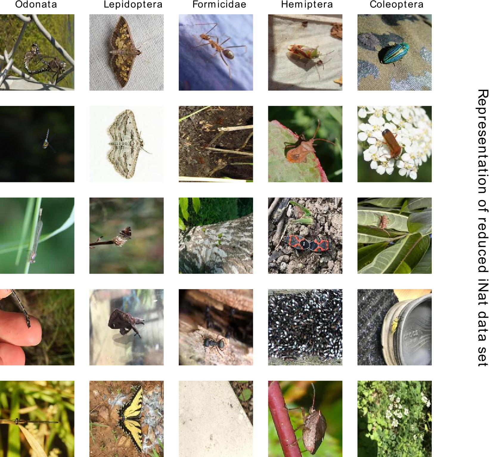
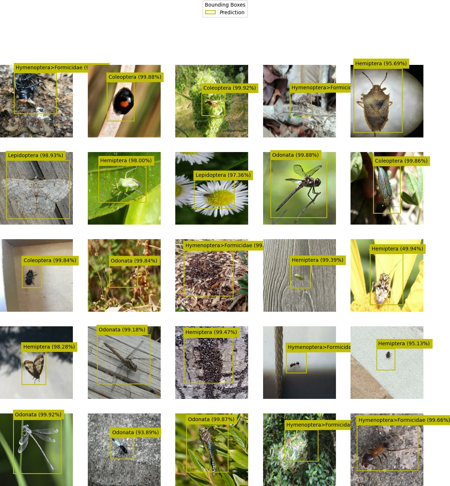
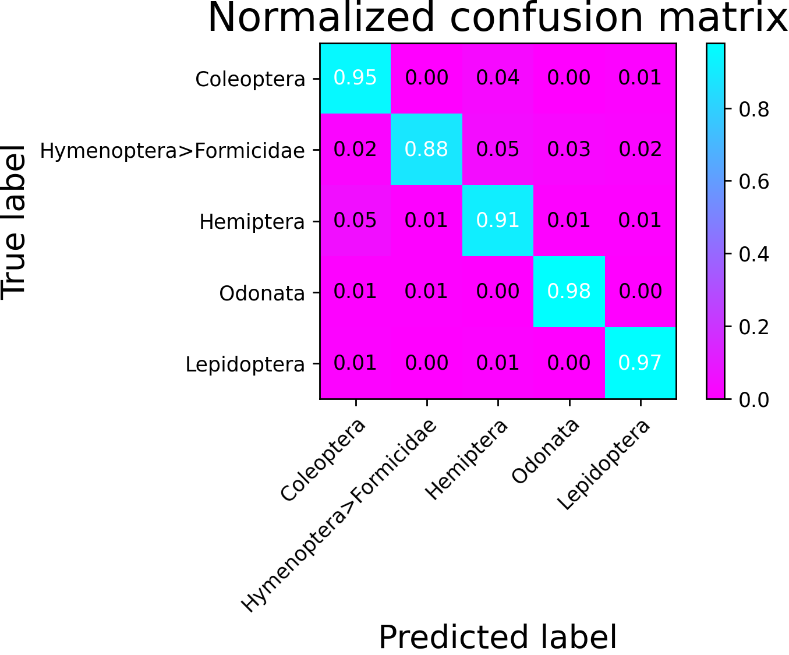

## Thesis: Machine Learning Methods for Localization and Classification of Insects in Images
A look into ML methods for single object detection, solving the tasks of insect genera classification
and bounding box regression, individually as well as simultaneously.

## Description
This project contains all content and things around the underlying thesis.
The submitted paper can be found in `./docs/thesisphilipp.pdf`.

The repository contains the `./docs` directory holding research and the theoretical part of the paper.
A demo app is under development, that can be found in the `./src/webapp` directory.

The accommodating code to the paper and the webapp is located in `./src`.
For more details consult the documentation pages.

## Visuals


### Data Augmentation


### Predictions
```text
Classification:
 ===================================
    Accuracy:   0.916
    f1 score:   0.9167668857681328

Localization:
 ===================================
    GIoU:   0.4361618
```





## Installation

### Prerequesites:
- An account to access the VPN, as well as an account to access the NAS is required
- `openfortivpn`
- set environment variables according to `./scripts/mount_directories.sh`
- `python >= 3.8, virtualenv`, optional `docker`

## Usage
### Datasets
#### recreate a pre-labelled training set:
```shell
$ sudo ./scripts/mount_directories.sh on
$ python -m scripts.reuse_labels bounding-boxes-2022-02-12-14-33.json mnt/KInsektDaten/data/iNat/train_Insecta/ data/iNat/storage
```
#### generate a training set:

1. Set environment variables `USERNAME` (username on NAS), `PASSWORD` (password for NAS), `VPN_USER` and `VPN_PASSWD` accordingly
2. Run
```shell
$ sudo ./scripts/mount_directories.sh on
```
3. To generate a dataset from the source `mnt/KInsektDaten/data/iNat/train_Insecta/`:
    ```shell
    $ python -m scripts.preselect_files --seed 42 -g 20 -s 25 -rng -l ../mnt/KInsektDaten/data/iNat/train_Insecta/ ../data/iNat/
    ```
for more options see `-h`.

4. Upload the files within the (default) target directory `./data/iNat/storage` into ["Label-Studio"](https://labelstudio-kinsekt.app.datexis.com) and annotate bounding boxes.

optionally Launch [LabelStudio](https://labelstud.io/)

    $ docker run -it -p 8080:8080 -v $PWD/data/iNat:/label-studio/data -e LABEL_STUDIO_LOCAL_FILES_SERVING_ENABLED=true -e LABEL_STUDIO_LOCAL_FILES_DOCUMENT_ROOT=/label-studio/data heartexlabs/label-studio:latest

5. Create labels for image files
6. Export the labels from LStudio
7. Generate file structure for train, test and validation sets by running
```shell
$ python -m scripts.process_files -input_directory data/iNat/storage -output_directory data/iNat/data -test 0.1 -val 0.2 bounding-boxes-2022-02-12-14-33.json
```
8. Generate cropped dataset for classification task
```shell
$ python -m scripts.generate_cropped_dataset data/iNat/
```

### Inference tests
To test inference of trained models run scripts from the `./tests` directory.

#### `test_tf_architectures.py`
Executes inference tests on pretrained optimized instances of
- `IndependentModel`
- `TwoStageModel`
- `SingleStageModel`

#### `test_yolo_inference.py`
Executes inference tests on [YoloV5](https://github.com/ultralytics/yolov5).

#### `test_tf_lite_architectures.py`
Executes inference tests on TFLite compatible versions of pretrained optimized instances of
- `IndependentModel`
- `TwoStageModel`
- `SingleStageModel`


## Support
In case you need help setting up the project or run into issues please create a ticket within the repositories issue tracker

## License
Unless marked differently all code and content in this repository is published under [GNU GPL-3.0](LICENSE).
## Project status
First release is v1.0.0
